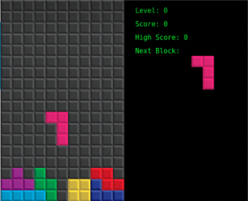

# quadris

C++ implementation of non-realtime Tetris using multithreading with mutex locks, smart pointers, and the QT graphics libary.

## [UML Diagram](./uml.pdf)

## Design Patterns

Implements the following design patterns:
- Adapter
- Strategy
- MVC
- Observer
- Iterator
- Facade
- Factory
- Decorator
