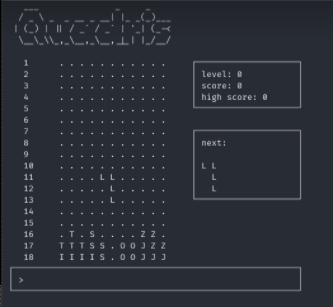

# quadris

C++ implementation of a Tetris-like game using multithreading with mutex locks, smart pointers, and the Qt graphics libary.

### To run:
1. Build the project using qmake && make, or run build.sh
2. Run the application by executing ./quadris

## Screenshots

## [UML Diagram](./uml.pdf)

## Design Patterns

Implements the following design patterns:
- Adapter
- Strategy
- MVC
- Observer
- Iterator
- Facade
- Factory
- Decorator
